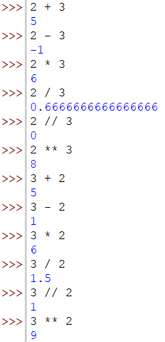
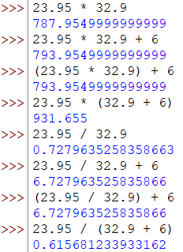
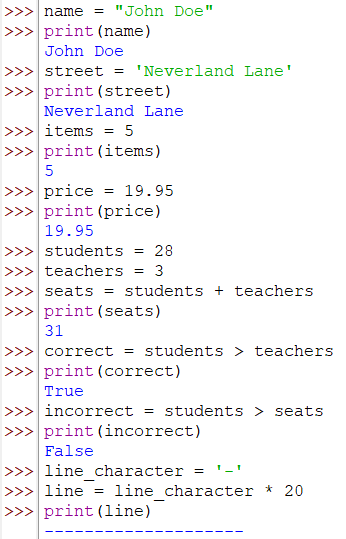
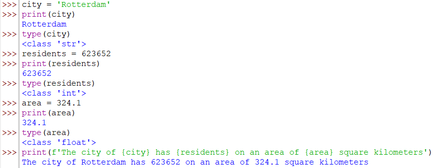

# Opdracht
Onderstaand vindt je diverse opdrachten waar je mee aan de slag kunt.

## Installatie Python
Download Python van https://python.org
Installeer het en kijk of je de Python applicatie kunt starten.

### Oefenen met de REPL
De REPL (Read Evaluate Print Loop) is de Python commandline. Je kunt hier direct Python commando's tikken en het resultaat direct zien. Dit is een niet te onderschatten krachtige mogelijkheid.

# Standaard rekenoperatoren
Maak de volgende berekeningen en denk bij elke berekening na over het te verwachten resultaat:

```python

2 + 3

2 - 3

2 * 3

2 / 3

2 // 3

2 ** 3

3 + 2

3 - 2

3 * 2

3 / 2

3 // 2

3 ** 2

```

### Output



## Haakjes
```python

23.95 * 32.9

23.95 * 32.9 + 6

(23.95 * 32.9) + 6

23.95 * (32.9 + 6)

23.95 / 32.9

23.95 / 32.9 + 6

(23.95 / 32.9) + 6

23.95 / (32.9 + 6)

```

### Output



## Variabelen
```python

name = "John Doe"
print(name)

street = 'Neverland Lane'
print(street)

items = 5
print(items)

price = 19.95
print(price)

students = 28
teachers = 3
seats = students + teachers
print(seats)

correct = students > teachers
print(correct)

incorrect = students > seats
print(incorrect)

line_character = '-'
line = line_character * 20
print(line)

```

### Output



# IDLE
De bij Python meegeleverde editor kan je ook gebruiken om Python programma's mee te ontwikkelen. Deze is heel kaal en daarom voor sommige een rustige overgang naar het maken van programma's.
Start IDLE, programmeer de volgende code en run deze. Je moet de programma's eerst opslaan om ze te kunnen runnen.

```python

city = 'Rotterdam'
print(city)
type(city)

residents = 623652
print(residents)
type(residents)

area = 324.1
print(area)
type(area)

# Formatted string, variabele in string weergeven
print(f'The city of {city} has {residents} on an area of {area} square kilometers')

```

### Output



# IDE's
IDE's zijn Integrated Development Environments. Hierin zitten meer functies dan alleen het teksteditor deel. Ze helpen je behoorlijk tijdens het ontwikkelen van je applicatie.

Na de IDLE editor ben je waarschijnlik to aan een 'echte' editor. Er zijn verschillende goede editors, zowel betaald als gratis open source of de community edities.
Enkele voorbeelden:
* PyCharm is er in betaalde en community editie versie.
* Visual Studio Code aka VS Code is een gratis open source versie.
* Sublime Text is een betaalde IDE.

Installeer een van deze editors en probeer jezelf een beetje bekend te maken met de verschillende menu opties/mogelijkheden/etc. Kijk bijvoorbeeld een introductie youtube van jouw editor.

Zorg ervoor dat de eidtor werkt bij de volgende les.
Test dit door het programma te openen wat je hebt gemaakt in de IDLE editor.
