# Opdracht
Onderstaand vind je diverse opdrachten waar je mee aan de slag kunt. Type de opdrachten altijd zelf, zodat je de Python syntax in de vingers krijgt. Bij gemaakte fouten ga je de errors herkennen en leer je sneller wat je moet doen om deze te herstellen.
Type onderstaande opgaven in en kijk wat voor output je op het scherm krijgt. Pas een waarde aan en kijk wat het effect is. Dit zijn de basis dingen waar we later alles op gaan bouwen. Het is essentieel dat je deze zaken goed snapt.

## Integers
Rekenen met integers heb je in de vorige les al een beetje gedaan. We gaan nu naar wat grotere getallen kijken. Python kan namelijk met enorme getallen omgaan. Dit kost uiteraard enorme rekenkracht waardoor sommige PC's langere tijd non-responsive kunnen worden. Hier zijn de getallen niet extreem gekozen.

```python
# Display large numbers in a readable format
people = 7861304740
print(people)
# Je mag underscores gebruiken om getallen leesbaar te maken
people = 7_861_304_740
print(people)
```

### Output
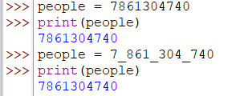


```python
people = 7_861_304_740
# Calculations with big numbers
meals = 3
people_eat = people * meals
print(people_eat)

days = 365
meals_per_year = people_eat * days
print(meals_per_year)

# What is the data type?
type(meals_per_year)
```

### Output


## Float
Het floating point data type kan gebroken getallen weergeven. Dit zagen we bij de delingen die we eerder hebben gemaakt.

```python
# Ethernet capacity
ethernet_speed_mbps = 1000
efficiency = 0.7
maximum_capacity = ethernet_speed_mbps * efficiency
print(maximum_capacity)

```

### Output
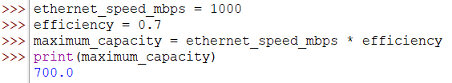


```python
# Print capacity used on the ethernet
ethernet_speed_mbps = 1000
download_speed_average = 96.25
usage = ethernet_speed_mbps / download_speed_average
print(usage)

```

### Output


```python
# Speed of light in m/s
speed_of_light = 299_792_458

# Distance Rotterdam / New York in km
distance_Rotterdam_NewYork = 5_862.03
# Distance Rotterdam to New York in meters divided by the speed of light
time_to_reach_NYC = (distance_Rotterdam_NewYork * 1000) / speed_of_light
print(f'Time to reach New York is: {time_to_reach_NYC} seconds => {time_to_reach_NYC * 1000.0} milliseconds.')

# What is the data type?
type(time_to_reach_NYC)

```

### Output
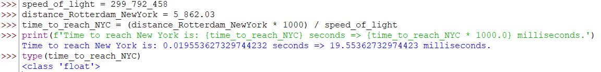


## String
De string is een enorm uitgebreid datatype, waarvan we gaande weg steeds meer gaan gebruiken. In eerste instantie gaan we hem gebruiken om regels te bewaren/weer te geven.

```python
ship = 'Titanic'
print(ship)
ship = "Titanic"
print(ship)
ship = """Titanic"""
print(ship)
```

### Output
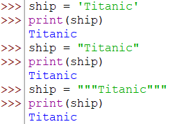


```python
# Vaak zul je quotes in een string moeten gebruiken. Dit kan met de escape character \, of door de string met enkele quotes te omringen
zonder_escape = 'This is a "good" plan'
print(zonder_escape)
met_escape = "This is a \"good\" plan"
print(met_escape)

```

```python
# Gebruik """ """ als je meerdere regels tekst moet tonen
paragraph = """Computer Technology means all designs, drawings, procedures (including design, manufacturing, test and maintenance procedures), specifications, software (other than as described within the meaning of the term "Software" defined elsewhere herein), printed circuit board art work, integrated circuit masks, test equipment, tools, fixtures, documentation, training materials, and information, in whatever form, related to, useful, utilizable or necessary in the design, manufacture, test and/or maintenance of the computer system, or relate to any Technology Licenses."""
print(paragraph)
# With the len() function you can ask how many characters the string has
characters_in_paragraph = len(paragraph)
print(f"{paragraph}\n\nThe paragraph has {characters_in_paragraph} characters.")

```

### Output
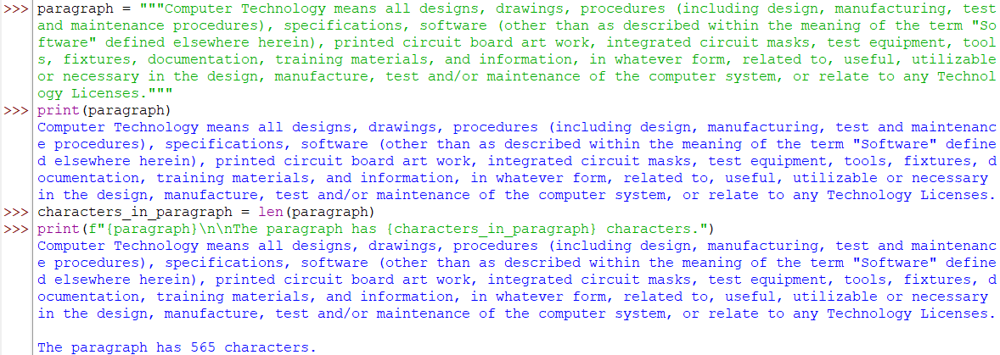


```python
year = 1936
inventor = "Alan Turing"
name_of_machine = "automatic machine"
# Note: Within the text double quotes are used. We need to use single quotes to embrace the string
invention = f'The Turing machine was invented in {year} by {inventor}, who called it an "a-machine" ({name_of_machine}).'
print(invention)

# What is the data type?
type(invention)

```

### Output
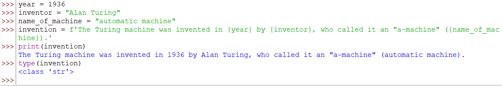


## Boolean
Programmeren betekent veel beslissingen nemen. Als "dit" dan "dat", of wat we vaker zeggen, als "dit is waar" dan "doe dat". Waar en niet waar zijn de basis van de boolean, in python aangegeven met True en False (let op de hoofdletters!).

```python
logged_in = False
print(logged_in)

netwerk_activity = True
print(netwerk_activity)
```

### Output
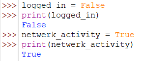

### Logische operatoren
Vergelijkingsoperatoren zijn operatoren die twee waarden met elkaar vergelijken. De uitkomst van een vergelijking is altijd een boolean. De volgende vergelijking operatoren zijn beschikbaar:
| Operator | Betekenis |
| --- | --- |
| == | Is gelijk aan |
| != | Is niet gelijk aan |
| < | Is kleiner dan |
| <= | Is kleiner dan of gelijk aan |
| > | Is groter dan |
| >= | Is groter dan of gelijk aan |

```python
user_name = "John Doe"
entered_name = input("User name, please: ")
size_user_name = len(user_name)
size_entered_name = len(entered_name)
user_name_is_bigger = size_user_name > size_entered_name
entered_name_is_bigger = size_entered_name > size_user_name
print(f"The user name {user_name} has more characters then the entered name {entered_name} is: {user_name_is_bigger}")
print(f"The entered name {entered_name} has more characters then the user name {user_name} is: {entered_name_is_bigger}")

lights_on = False
lock_closed = True
# Not keert de waarde van een boolean om not True is hetzelfde als False
# Andersom is not False dus True
alarm_activated = not lights_on and lock_closed
print(f"The alarm is activated, is: {alarm_activated}")

```

### Output
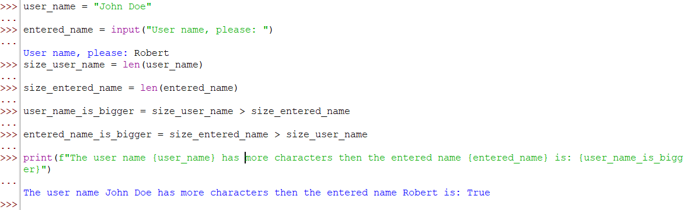

## Containers
Op een terminal worden schepen gelost en geladen. Tijdens het lossen worden 331 containers gelost in 441 minuten. Na het lossen wordt het schip geladen met 287 containers in 295 minuten.
Bedenk een goede representieve variabele naam voor de *geloste* containers en ken het aantal geloste containers toe aan de variabele.
Bedenk een goede representieve variabele naam voor de *geladen* containers en ken het aantal geladen containers toe aan de variabele.
Bereken van zowel het laden als lossen de gemiddelde laad/lostijd. Geef deze weer op in een volzin: De gemiddelde tijd die het laden of lossen duurt.

### Output
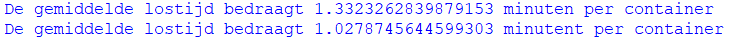

### Uitwerking
Een voorbeeld uitwerking: [Les2_Source3.py](Uitwerkingen%2FLes2_Source3.py)


## Berekening
Zet de volgende formule om naar Python code:

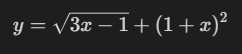


Bereken het antwoord als x = 9.1
Geef het antwoord weer in de volzin:

De waarde van y = [antwoord berekening] als x = [waarde van x].

### Output


### Uitwerking
Een voorbeeld uitwerking: [Les2_Source1.py](Uitwerkingen%2FLes2_Source1.py)

## Berekening
Zet de volgende formule om naar Python code:

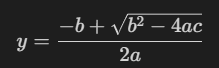


Bereken het antwoord als:
- a = 0.87
- b = 22.7
- c = 5.03

Geef het antwoord weer in een volzin:
De waarde van y = [antwoord berekening] als a = {waarde van a}, b = {waarde van b} en c = {waarde van c}

### Output


### Uitwerking
Een voorbeeld uitwerking: [Les2_Source2.py](Uitwerkingen%2FLes2_Source2.py)


## Berekening
Tijd en ruimte zijn geen absolute concepten, maar relatief en afhankelijk van de snelheid van de waarnemer.
Met behulp van onderstaande formule kan worden berekend hoeveel de tijd versneld of vertraagd afhankelijk van de snelheid van de waarnemer.
U kijkt vanaf uw tuinstoel gedurende t = 4 uur naar een passeerde komeet die met een snelheid van v = 179875474.8 m/s langs de hemel trekt.
Hoeveel tijd zou er gepasseerd zijn als u op de komeet zou zitten en naar uw tuinstoel op de aarde keek, gegeven dat de lichtsnelheid c = 299792458 m/s?
Gegeven de formule: 

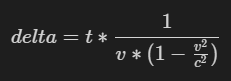

Bereken de delta en druk het berekende antwoord af op het scherm in de zin:

Vanaf een komeet gezien zit u {x} uur op de tuinstoel.
Waarbij de {x} wordt vervangen door het berekende antwoord.

### Output
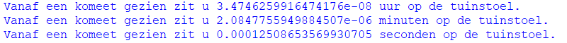

### Uitwerking
Een voorbeeld uitwerking: [Les2_Source4.py](Uitwerkingen%2FLes2_Source4.py)

