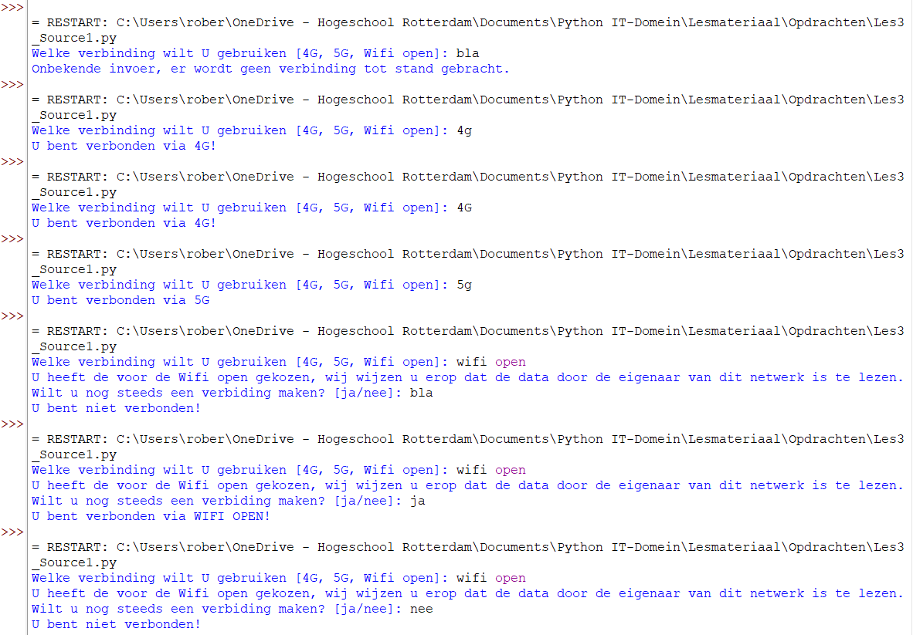
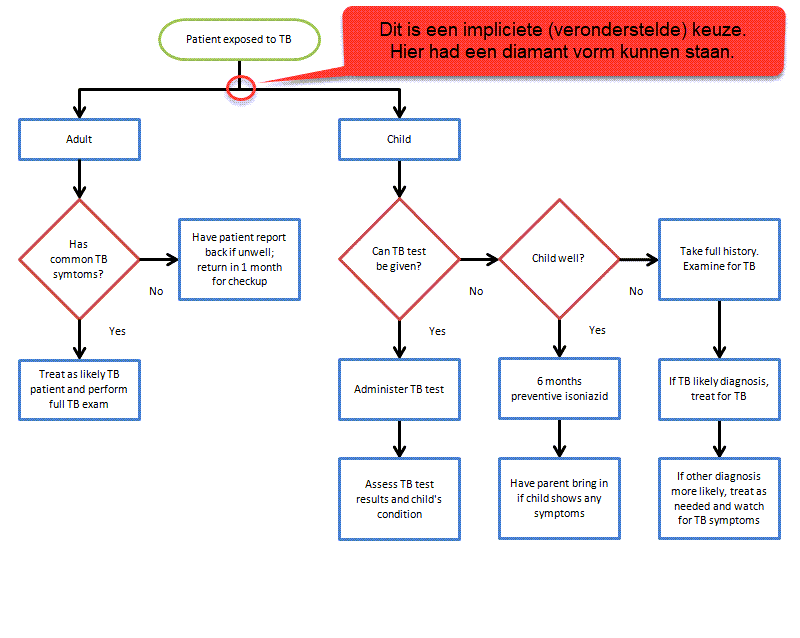
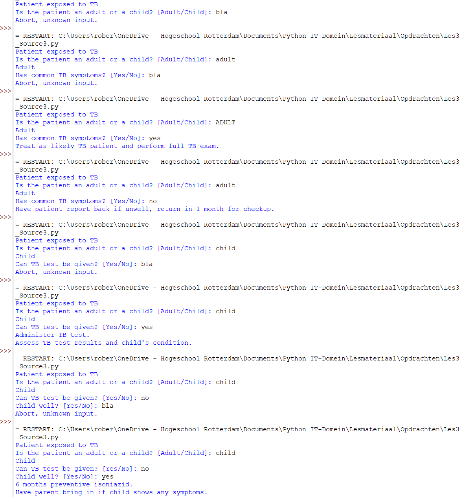
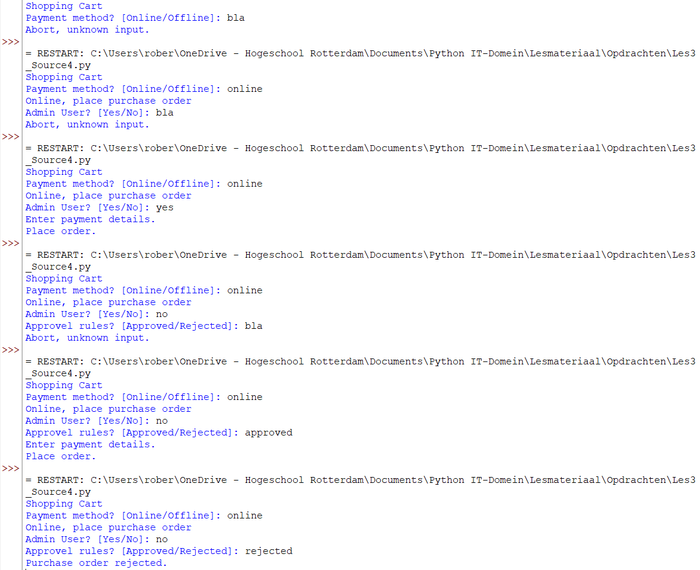
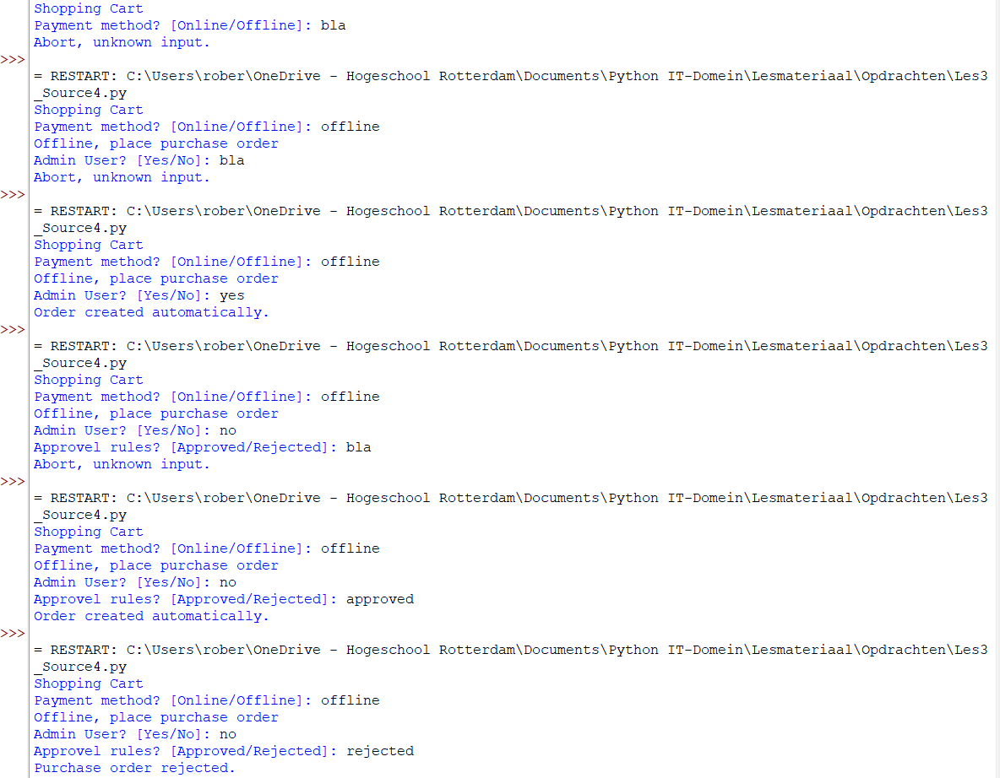
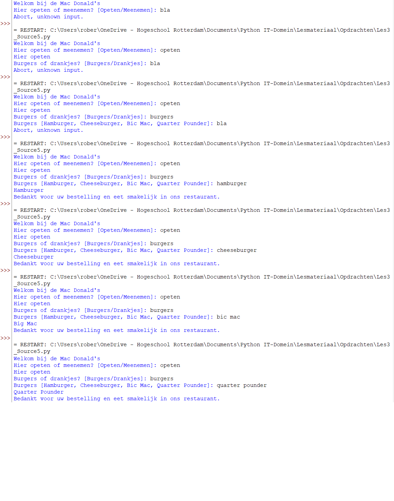
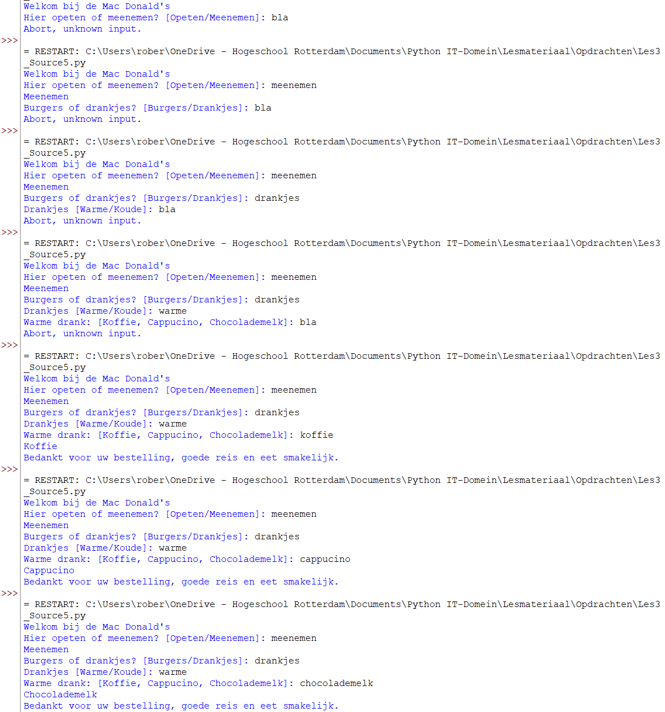
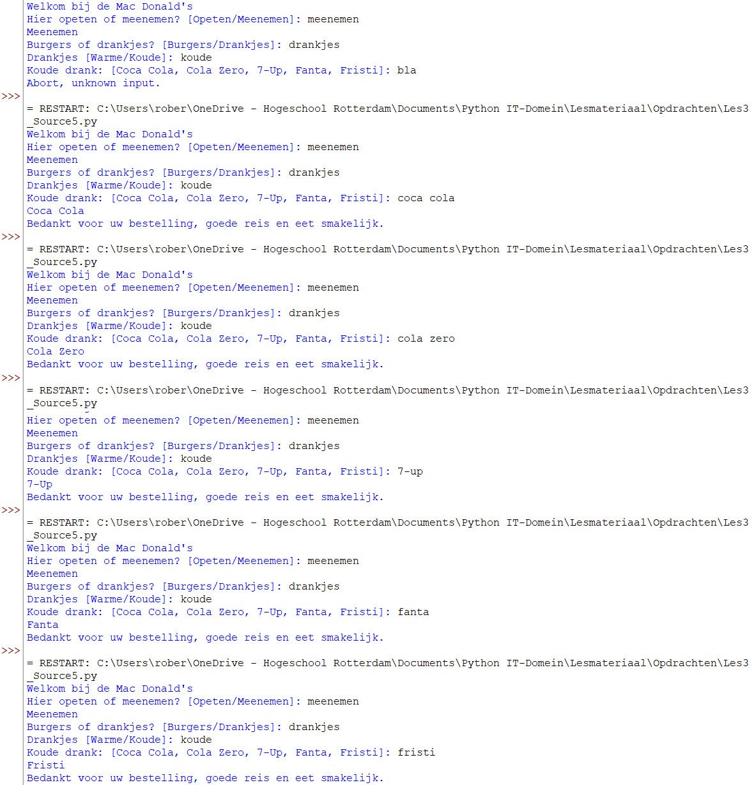

# Opdracht
Onderstaand vindt je diverse opdrachten waar je mee aan de slag kunt.
Type de opdrachten altijd zelf, zodat je de Python syntax in de vingers krijgt. Bij gemaakte fouten ga je de errors herkennen. Op een gegeven moment weet je wat je moet doen om dit te herstellen.
Type onderstaande opgaven in en kijk wat voor output je op het scherm krijgt. Pas een waarde aan en kijk wat het effect is. Dit zijn de basis dingen waar we later alles op gaan bouwen. Het is essentieel dat je deze zaken goed snapt.


## Input vragen
Met de functie input() kan je input van de gebruiker vragen. Dat ziet eruit als:

```python
age_str = input('What is your age? ')
print(f'Your age is {age_str}')

```

### Output


De input() functie levert altijd een string terug, vandaar dat de variabele _str heeft meegekregen, om dit te benadrukken. Dit is overigens de enige plaats waarop deze toevoeging handig is.


# Internet verbindngsselectie
Vraag aan de gebruiker welke verbinding hij/zij wil gebruiken om met het internet te verbinden. Keuze uit:
- 4G
- 5G
- Wifi open

Als de gebruiker de Wifi open kiest, dan geef je een extra waarschuwing:
*"U heeft de voor de Wifi open gekozen, wij wijzen u erop dat de data door de eigenaar van dit netwerk is te lezen."*. Vervolgens stel je nog de vraag of de gebruiker nog steeds wil verbinden. Waarbij de gebruiker *"ja"* of *"nee"* kan antwoorden. Als de gebruiker met *"ja"* antwoord dan krijgt deze het standaard antwoord met de verbindingskeuzes. Bij *"nee"* of een onbekende invoer krijgt de gebruiker de melding: *"U bent niet verbonden!"*.

Bij alle andere verbindingskeuzes geef je de tekst: *"U bent verbonden via \<**hier de gekozen verbinding plaatsen**>!"*

Wanneer je onbekende invoer krijgt geef je de melding: *"Onbekende invoer, er wordt geen verbinding tot stand gebracht."*

```python
connection_choice_str = input('Welke verbinding wilt U gebruiken [4G, 5G, Wifi open]: ')

# Convert answer to upper case
# The user can enter upper, lower or combined casing
connection_choice = connection_choice_str.upper()

if connection_choice == "4G":
    print(f"U bent verbonden via {connection_choice}!")
elif connection_choice == "5G":
    print(f"U bent verbonden via {connection_choice}")
elif connection_choice == "WIFI OPEN":
    print(f"U heeft de voor de Wifi open gekozen, wij wijzen u erop dat de data door de eigenaar van dit netwerk is te lezen.")
    answer_str = input("Wilt u nog steeds een verbinding maken? [ja/nee]: ")
    answer = answer_str.upper()
    if answer == "JA":
        print(f"U bent verbonden via {connection_choice}!")
    else:
        print("U bent niet verbonden!")
else:
    print("Onbekende invoer, er wordt geen verbinding tot stand gebracht.")

```

### Output



## Vergelijken met een sub-string
Controleren of een string als substring in een string zit doe je middels het keyword **in**. Bijvoorbeeld:

```python
print("Is Hello with a capital 'H' within the string 'Hello, everyone!'")
if "Hello" in "Hello, everyone!":
    print('Yes, Hello is within the Hello, everyone! string')

print("Is Hello with a lower case 'h' within the string 'Hello, everyone!'")
if "hello" in "Hello, everyone!":
    print('Yes, hello is within the Hello, everyone! string')
else:
    print('No, hello with small letters in not within the string')

```

### Output


## Flowchart
Maak een Python programma die onderstaande flowchart implementeert.
Van alle elipsen/ronde/rechthoek symbolen print je de tekst van de flowchart. De diamanten zijn je *if* statements, waar je aan de gebruiker een input vraagt. Bijvoorbeeld: yes of no antwoord.



```python
# Patient exposed to TB [Tuberculoses]
print("Patient exposed to TB")
question_1_str = input("Is the patient an adult or a child? [Adult/Child]: ")
question_1 = question_1_str.upper()
if question_1 == "ADULT":
    # Adult part
    print("Adult")
    question_2_str = input("Has common TB symptoms? [Yes/No]: ")
    question_2 = question_2_str.upper()
    if question_2 == "YES":
        print("Treat as likely TB patient and perform full TB exam.")
    elif question_2 == "NO":
        print("Have patient report back if unwell, return in 1 month for checkup.")
    else:
        print("Abort, unknown input.")
elif question_1 == "CHILD":
    # Child part
    print("Child")
    question_3_str = input("Can TB test be given? [Yes/No]: ")
    question_3 = question_3_str.upper()
    if question_3 == "YES":
        print("Administer TB test.")
        print("Assess TB test results and child's condition.")
    elif question_3 == "NO":
        question_4_str = input("Child well? [Yes/No]: ")
        question_4 = question_4_str.upper()
        if question_4 == "YES":
            print("6 months preventive isoniazid.")
            print("Have parent bring in if child shows any symptoms.")
        elif question_4 == "NO":
            print("Take full history.\nExamine for TB.")
            print("If TB likely diagnosis, treat for TB.")
            print("If other diagnosis more likely, treat as needed and watch for TB symptoms.")
        else:
            print("Abort, unknown input.")
    else:
        print("Abort, unknown input.")
else:
    print("Abort, unknown input.")

```

### Output



## Flowchart
Maak een Python programma die onderstaande flowchart implementeert.
Van alle elipsen/ronde/rechthoek/rechthoekgolf symbolen print je de tekst van de flowchart. De diamanten zijn je *if* statements, waar je aan de gebruiker een input vraagt. Bijvoorbeeld: *yes* of *no* antwoord.


```python
# Shopping Cart
print("Shopping Cart")
question_1_str = input("Payment method? [Online/Offline]: ")
question_1 = question_1_str.upper()
if question_1 == "ONLINE":
    # Online part
    print("Online, place purchase order")
    question_2_str = input("Admin User? [Yes/No]: ")
    question_2 = question_2_str.upper()
    if question_2 == "YES":
        print("Enter payment details.")
        print("Place order.")
    elif question_2 == "NO":
        question_3_str = input("Approvel rules? [Approved/Rejected]: ")
        question_3 = question_3_str.upper()
        if question_3 == "APPROVED":
            print("Enter payment details.")
            print("Place order.")
        elif question_3 == "REJECTED":
            print("Purchase order rejected.")
        else:
            print("Abort, unknown input.")
    else:
        print("Abort, unknown input.")
elif question_1 == "OFFLINE":
    # Offline part
    print("Offline, place purchase order")
    question_4_str = input("Admin User? [Yes/No]: ")
    question_4 = question_4_str.upper()
    if question_4 == "YES":
        print("Order created automatically.")
    elif question_4 == "NO":
        question_5_str = input("Approvel rules? [Approved/Rejected]: ")
        question_5 = question_5_str.upper()
        if question_5 == "APPROVED":
            print("Order created automatically.")
        elif question_5 == "REJECTED":
            print("Purchase order rejected.")
        else:
            print("Abort, unknown input.")
    else:
        print("Abort, unknown input.")
else:
    print("Abort, unknown input.")
    
```

### Output




## Bestellen
Eten bestellen bij de **Mac Donald's**.
Maak een programma die aan de gebruiker de bestelling vraagt. De gebruiker kan slechts 1 keuze maken. Dat wil zeggen dat hij/zij slechts 1 burger of 1 drankje kan kiezen. 
De volgende vragen stel je aan de gebruiker:
- Hier opeten of meenemen?
- Burgers of drankjes?
    - Burgers:
        - Hamburger
        - Cheese burger
        - Big Mac
        - Quarter Pounder met of zonder kaas?
    - Drankjes:
        - Warme of koude drankjes:
            - Warme drankjes:
                - Koffie
                - Cappucino
                - Chocolademelk
            - Koude drankjes:
                - Coca Cola
                - Cola Zero
                - 7-up
                - Fanta
                - Fristi

Elke keer als de gebruiker een bestelling kiest geef je deze op het scherm weer.
Als de gebruiker *"hier op eten"* heeft gekozen, dan zeg je aan het einde: "*Bedankt voor uw bestelling en eet smakelijk in ons restaurant.*"
Als de gebruiker *"Meenemen"* heeft gekozen, dan zeg je aan het einde: "*Bedankt voor uw bestelling, goede reis en eet smakelijk.*"

```python
# Ordering at Mac Donald's
eat_in = False
eat_out = False
aborted = False

print("Welkom bij de Mac Donald's")
question_1_str = input("Hier opeten of meenemen? [Opeten/Meenemen]: ")
question_1 = question_1_str.upper()
if question_1 == "OPETEN":
    # Eat in part
    print("Hier opeten")
    eat_in = True
elif question_1 == "MEENEMEN":
    # Take away part
    print("Meenemen")
    eat_out = True
else:
    aborted = True

if eat_in or eat_out:
    question_2_str = input("Burgers of drankjes? [Burgers/Drankjes]: ")
    question_2 = question_2_str.upper()
    if question_2 == "BURGERS":
        question_3_str = input("Burgers [Hamburger, Cheeseburger, Bic Mac, Quarter Pounder]: ")
        question_3 = question_3_str.upper()
        if question_3 == "HAMBURGER":
            print("Hamburger")
        elif question_3 == "CHEESEBURGER":
            print("Cheeseburger")
        elif question_3 == "BIC MAC":
            print("Big Mac")
        elif question_3 == "QUARTER POUNDER":
            print("Quarter Pounder")
        else:
            aborted = True
    elif question_2 == "DRANKJES":
        question_4_str = input("Drankjes [Warme/Koude]: ")
        question_4 = question_4_str.upper()
        if question_4 == "WARME":
            question_5_str = input("Warme drank: [Koffie, Cappucino, Chocolademelk]: ")
            question_5 = question_5_str.upper()
            if question_5 == "KOFFIE":
                print("Koffie")
            elif question_5 == "CAPPUCINO":
                print("Cappucino")
            elif question_5 == "CHOCOLADEMELK":
                print("Chocolademelk")
            else:
                aborted = True
        elif question_4 == "KOUDE":
            question_6_str = input("Koude drank: [Coca Cola, Cola Zero, 7-Up, Fanta, Fristi]: ")
            question_6 = question_6_str.upper()
            if question_6 == "COCA COLA":
                print("Coca Cola")
            elif question_6 == "COLA ZERO":
                print("Cola Zero")
            elif question_6 == "7-UP":
                print("7-Up")
            elif question_6 == "FANTA":
                print("Fanta")
            elif question_6 == "FRISTI":
                print("Fristi")
            else:
                aborted = True
        else:
            aborted = True
    else:
        aborted = True

if aborted:
    print("Abort, unknown input.")
else:
    if eat_in:
        print("Bedankt voor uw bestelling en eet smakelijk in ons restaurant.")
    elif eat_out:
        print("Bedankt voor uw bestelling, goede reis en eet smakelijk.")

```

### Output



