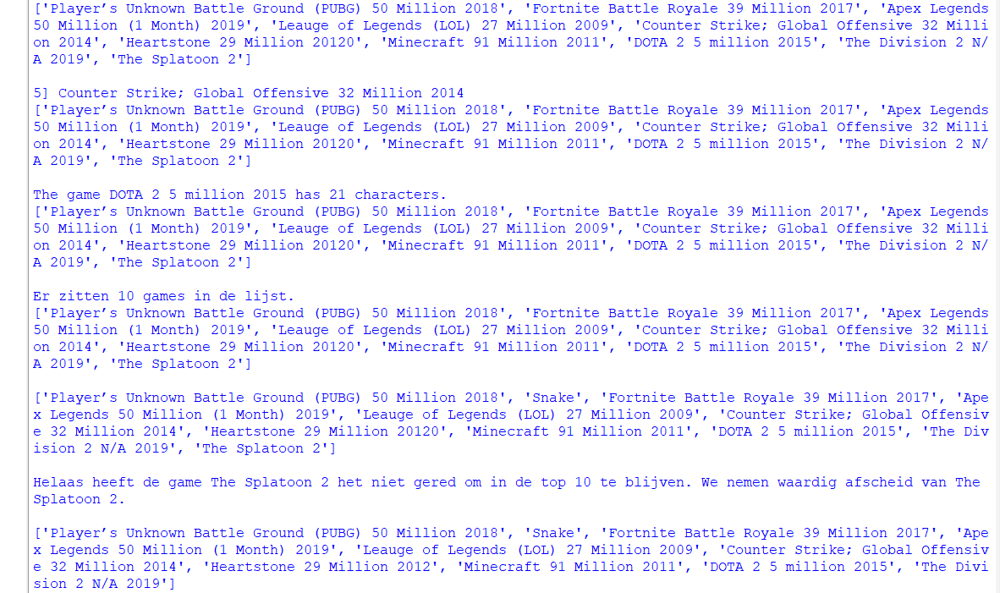
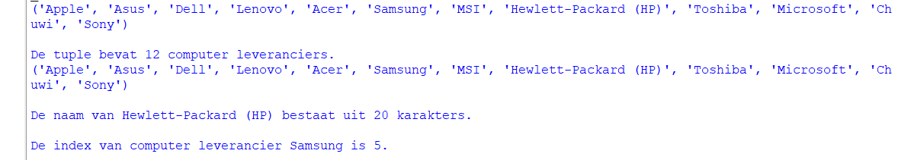
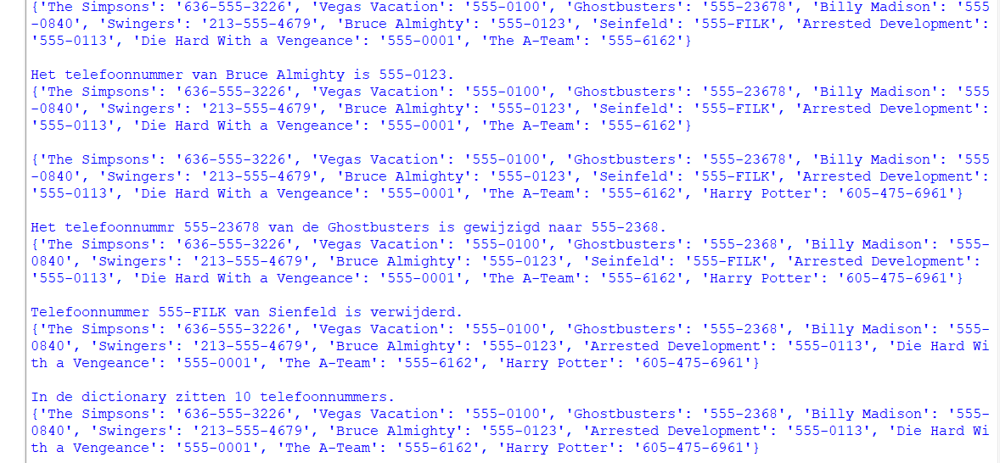

# Opdracht
Onderstaand vindt je diverse opdrachten waar je mee aan de slag kunt.
Type de opdrachten altijd zelf, zodat je de Python syntax in de vingers krijgt. Bij gemaakte fouten ga je de errors herkennen. Op een gegeven moment weet je wat je moet doen om dit te herstellen.
Type onderstaande opgaven in en kijk wat voor output je op het scherm krijgt. Pas een waarde aan en kijk wat het effect is. Dit zijn de basis dingen waar we later alles op gaan bouwen. Het is essentieel dat je deze zaken goed snapt.


# List of games
Gegeven een lijst met 10 populaire games in 2021.

- Player’s Unknown Battle Ground (PUBG) 50 Million 2018
- Fortnite Battle Royale 39 Million 2017
- Apex Legends 50 Million (1 Month) 2019
- Leauge of Legends (LOL) 27 Million 2009
- Counter Strike; Global Offensive 32 Million 2014
- Heartstone 29 Million 20120
- Minecraft 91 Million 2011
- DOTA 2 5 million 2015
- The Division 2 N/A 2019
- The Splatoon 2


## Opdrachten
Maak een Python programma waarin de games in een lijst worden opgeslagen. De naam van de lijst is betekenisvol voor de data die in de lijst staat. M.a.w. een variabele naam waaraan je direct ziet waar de elementen van de lijst over gaan.
Na elke opdracht geef je de lijst op het scherm weer.

```python
print(naam_van_mijn_lijst)
```

>a] Geef de 5de game *(Counter Strike)* uit de lijst op het scherm weer met **5]** ervoor.

>b] Geef de lengte van de tekst van de 8ste game *(DOTA)* uit de lijst weer.

>c] Geef op het scherm weer met een volzin: "Er zitten [aantal games] games in de lijst." Vervang daarbij [aantal games] door het aantal elementen in de lijst. Vraag het aantal elementen op uit de lijst.

>d] De ranking moet worden aangepast want de game Snake blijkt een instant hit en komt binnen op de 2de plaats. Voeg de game Snake toe aan de lijst op de tweede plaats.

>

>e] Verwijder de game *"The Splatoon"* uit de lijst en geef de naam op het scherm weer zoals deze uit de lijst is gekomen in een volzin: *"Helaas heeft de game [naam van de game] het niet gered om in de top 10 te blijven. We nemen waardig afscheid van [naam van de game]."*

>f] Nadat de redactie de lijst had gezien, hebben ze de opmerking geplaatst dat er een fout zit in de tekst van de game *"Heartstone"*. Het jaartal moet 2012 zin. Pas de tekst in de lijst aan met Python code.


```python
# List of Games
popular_games = ["Player’s Unknown Battle Ground (PUBG) 50 Million 2018",
                 "Fortnite Battle Royale 39 Million 2017",
                 "Apex Legends 50 Million (1 Month) 2019",
                 "Leauge of Legends (LOL) 27 Million 2009",
                 "Counter Strike; Global Offensive 32 Million 2014",
                 "Heartstone 29 Million 20120",
                 "Minecraft 91 Million 2011",
                 "DOTA 2 5 million 2015",
                 "The Division 2 N/A 2019",
                 "The Splatoon 2"]

print(popular_games)

# a]
print(f"5] {popular_games[4]}")
print(popular_games)

# b]
dota_game = popular_games[7]
characters_in_name = len(dota_game)
print(f"The game {dota_game} has {characters_in_name} characters.")
print(popular_games)

# c]
number_of_games = len(popular_games)
print(f"Er zitten {number_of_games} games in de lijst.")
print(popular_games)

# d]
popular_games.insert(1, "Snake")
print(popular_games)

# e]
index_of_splatoon = popular_games.index("The Splatoon 2")
splatoon = popular_games.pop(index_of_splatoon)
print(f"Helaas heeft de game {splatoon} het niet gered om in de top 10 te blijven. We nemen waardig afscheid van {splatoon}.")

# f]
index_of_heartstone = popular_games.index("Heartstone 29 Million 20120")
popular_games[index_of_heartstone] = "Heartstone 29 Million 2012"
print(popular_games)

```

### Output



# Tuple
Tuples zijn vergelijkbaar met lists. Ze zijn echter niet meer wijzigbaar nadat ze zijn aangemaakt.

Gegeven een lijst met computer leveranciers
- Apple
- Asus
- Dell
- Lenovo
- Acer
- Samsung
- MSI
- Hewlett-Packard (HP)
- Toshiba
- Microsoft
- Chuwi
- Sony

## Opdrachten
Maak een Python programma waarin de computer leveranciers in een tuple worden opgeslagen. De naam van de tuple is betekenisvol voor de data die in de lijst staat. M.a.w. een variabele naam waaraan je direct ziet waar de elementen van de tuple over gaan.
Na elke opdracht geef je de tuple op het scherm weer.

```python
print(naam_van_mijn_tuple)
```

>a] Geef in een volzin het aantal computer leveranciers in de tuple. *"De tuple bevat [aantal computer leveranciers] computer leveranciers."*

>b] Geef in een volzin het aantal karakters van computer leverencier nummer 8; *"De naam van [Naam computer leverancier] bestaat uit [aantal karakters] karakters."*

>c] Geef de naam van de computer leverancier op de 10de plaats

```python
# Tuple
computer_suppliers = ("Apple",
                      "Asus",
                      "Dell",
                      "Lenovo",
                      "Acer",
                      "Samsung",
                      "MSI",
                      "Hewlett-Packard (HP)",
                      "Toshiba",
                      "Microsoft",
                      "Chuwi",
                      "Sony")

print(computer_suppliers)
print()

# a]
number_of_computer_suppliers = len(computer_suppliers)
print(f"De tuple bevat {number_of_computer_suppliers} computer leveranciers.")

print(computer_suppliers)
print()

# b]
computer_supplier = computer_suppliers[7]
characters_in_name = len(computer_supplier)
print(f"De naam van {computer_supplier} bestaat uit {characters_in_name} karakters.")
print(computer_suppliers)
print()

# c]
index_of_computer_supplier = computer_suppliers.index("Samsung")
print(f"De index van computer leverancier {computer_suppliers[index_of_computer_supplier]} is {index_of_computer_supplier}.")
print(computer_suppliers)
print()

```

### Output



# Dictionary
De key/value pair collectie. Dit is wellicht het belangrijkste datatype in Python. Grote delen van de interne structuur is gebaseerd op dictionaries.

```python
print(naam_van_mijn_dictionary)
```

Gegeven een dictionary met telefoonnummers uit films *(naam van de film is de key, het nummer de value)*:
- The Simpsons, 636-555-3226
- Vegas Vacation, 555-0100
- Ghostbusters, 555-23678
- Billy Madison, 555-0840
- Swingers, 213-555-4679
- Bruce Almighty, 555-0123
- Seinfeld, 555-FILK
- Arrested Development, 555-0113
- Die Hard With a Vengeance, 555-0001
- The A-Team, 555-6162

## Opdrachten
>a] Geef het telefoonnummer van Bruce Almigthy in de volzin: *"Het telefoonnummer van Bruce Almighty is [telefoonnummer]."*

>b] Voeg het telefoonnummer van de Harry Potter toe, nummer: 605-475-6961 aan de dictionary.

>c] Pas het telefoonnummer van de Ghostbusters aan. Dit moet zijn 555-2368. Geef in een volzin weer. *"Het telefoonnummer [telefoonnummer] van de Ghostbusters is gewijzigd naar [nieuwe nummer]."*

>d] Verwijder het telefoonnummer van Seinfeld. Gebruik de volzin: *"Telefoonnummer [telefoonnummer] van Seinfeld is verwijderd."*

>e] Geef aan hoeveel telefoonnummers er nu in dictionary zitten. Gebruik de volzin: *"In de dictionary zitten [aantal telefoonnummers] telefoonnummers."*

```python
# Dictionary

phone_numbers = {"The Simpsons": "636-555-3226",
                 "Vegas Vacation": "555-0100",
                 "Ghostbusters": "555-23678",
                 "Billy Madison": "555-0840",
                 "Swingers": "213-555-4679",
                 "Bruce Almighty": "555-0123",
                 "Seinfeld": "555-FILK",
                 "Arrested Development": "555-0113",
                 "Die Hard With a Vengeance": "555-0001",
                 "The A-Team": "555-6162"}

print(phone_numbers)
print()

# a]
print(f"Het telefoonnummer van Bruce Almighty is {phone_numbers['Bruce Almighty']}.")
print(phone_numbers)
print()

# b]
phone_numbers["Harry Potter"] = "605-475-6961"
print(phone_numbers)
print()

# c]
old_phone_number = phone_numbers["Ghostbusters"]
new_phone_number = "555-2368"
phone_numbers["Ghostbusters"] = new_phone_number
print(f"Het telefoonnummr {old_phone_number} van de Ghostbusters is gewijzigd naar {new_phone_number}.")
print(phone_numbers)
print()

# d]
phone_number = phone_numbers.pop("Seinfeld")
print(f"Telefoonnummer {phone_number} van Sienfeld is verwijderd.")
print(phone_numbers)
print()

# e]
number_of_phone_numbers = len(phone_numbers)
print(f"In de dictionary zitten {number_of_phone_numbers} telefoonnummers.")
print(phone_numbers)
print()

```

### Output

